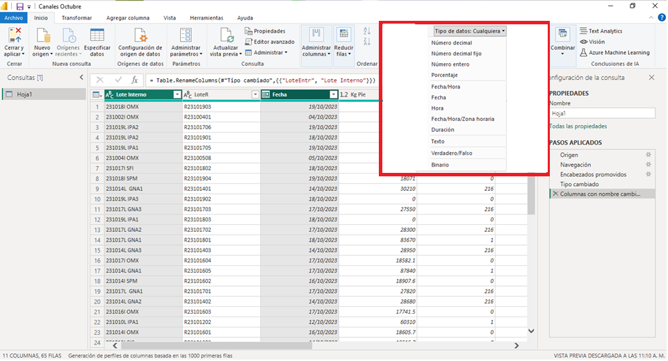

```text
Importante
Puede obtener la versión más reciente de Power BI Desktop desde Microsoft Store, o bien como un
único archivo ejecutable con todos los idiomas admitidos que debe descargar e instalar en el equipo.
```

## Funcionamiento de Power BI Desktop

Con Power BI Desktop, puede:

* Conectarse a datos, incluidos varios orígenes de datos.
* Dar forma a los datos con consultas que generan modelos de datos atractivos e interesantes.
* Usar los modelos de datos para crear visualizaciones e informes.
* Compartir los archivos de informe para que otros usuarios puedan aprovecharlos, ampliarlos y compartirlos.

Puede compartir los archivos `.pbix` de *Power BI Desktop* como cualquier otro archivo, pero el método más atractivo consiste en cargarlos en el [servicio Power BI](https://preview.powerbi.com/).

Power BI Desktop integra tecnologías probadas del motor de consultas de Microsoft, modelado de datos y visualización. Los analistas de datos y otros usuarios pueden crear colecciones de consultas, conexiones de datos, modelos e informes, y compartirlos fácilmente con otros. A través de la combinación de *Power BI Desktop* y el *servicio Power BI*, es más fácil modelar, compilar, compartir y extender nuevas conclusiones del mundo de los datos.

`Power BI Desktop` centraliza, simplifica y agiliza lo que de otro modo podría ser un proceso de diseño y creación de repositorios e informes de inteligencia empresarial disperso, arduo y desconectado.

## Instalar y ejecutar Power BI Desktop

Para descargar Power BI Desktop, vaya a la [página de descarga de Power BI Desktop](https://powerbi.microsoft.com/desktop) y seleccione *Descarga gratuita*. O, para las opciones de descarga, seleccione [Consulte las opciones de descarga](https://www.microsoft.com/download/details.aspx?id=58494) o idiomas disponibles.

También puede descargar *Power BI Desktop* desde el servicio Power BI. Seleccione el icono *Descargar* en la barra del menú superior y, después, seleccione *Power BI Desktop*.

En la página de Microsoft Store, seleccione *Obtener* y siga las indicaciones para instalar *Power BI Desktop* en el equipo. Inicie Power BI Desktop desde el menú Inicio de Windows o desde el icono de la barra de tareas de Windows.

La primera vez que se inicia Power BI Desktop, se muestra la pantalla de bienvenida.

<center>
    
</center>

En la pantalla de bienvenida, puede obtener datos, ver orígenes recientes, abrir informes recientes, abrir otros informes o seleccionar otros vínculos. Seleccione el icono Cerrar para cerrar la pantalla de bienvenida.

En el lado izquierdo de Power BI Desktop, aparecen los iconos de las tres vistas de Power BI Desktop: Informe, Datos y Modelo, en orden descendente. La vista actual se indica mediante la barra amarilla situada a la izquierda y puede cambiar de vista si selecciona cualquiera de los iconos.

<center>
    
</center>

Si usa la navegación mediante el teclado, presione `Ctrl + F6` para mover el enfoque a esa sección de botones en la ventana. Para más información sobre la accesibilidad y Power BI, consulte los artículos relacionados con la [accesibilidad](https://learn.microsoft.com/es-es/power-bi/create-reports/desktop-accessibility-creating-tools).

*Power BI Desktop* también incluye el `Editor de Power Query`, que se abre en una ventana independiente.

En el Editor de Power Query, puede crear consultas y transformar datos, y después cargar el modelo de datos refinados en Power BI Desktop para crear informes.

## Conectar a datos

Con *Power BI Desktop* instalado, está listo para conectarse con el mundo de los datos en continua expansión. Para ver los numerosos tipos de orígenes de datos disponibles, seleccione en la pestaña `Inicio` la opción `Obtener datos`> `Más` de *Power BI Desktop* y, en la ventana `Obtener datos`, desplácese por la lista `Todo` de orígenes de datos. En este paseo rápido, se conectará a dos orígenes de datos web diferentes.

<center>
    
</center>

Para obtener más información sobre cómo conectarse a los datos, vea [Conectarse a los datos en Power BI Desktop](https://learn.microsoft.com/es-es/power-bi/connect-data/desktop-connect-to-data).

## Dar forma a los datos

Ahora que se ha conectado a un origen de datos, puede ajustar los datos según sea necesario. Para dar forma a los datos, proporcione al *Editor de Power Query* instrucciones paso a paso para ajustar los datos mientras los carga y presenta. La operación de dar forma no afecta al origen de datos original, solo a esta vista concreta de los datos.

```text
El modelado puede significar transformar los datos, como cambiar el nombre de columnas o tablas,
quitar filas o columnas, o cambiar tipos de datos.
```

El Editor de Power Query captura estos pasos secuencialmente en `Pasos aplicados` en el panel `Configuración` de la consulta.

```text
Cada vez que esta consulta se conecte al origen de datos, se ejecutan esos pasos,
para que los datos siempre tengan la forma especificada.
```

<center>
    
</center>

```text
Nota Importante

Este proceso se produce siempre que se usa la consulta en Power BI Desktop, o bien cuando alguien
más use la consulta compartida, como en el servicio Power BI.

La importancia de utilizar el servicio Power BI, con licencia PRO, es que por medio de este servicio
se actualizan los informes en automatico, y no tener que enviar los informes cada que se vuelven
actualizar en el Software Power BI Desktop.
```

Tenga en cuenta que en `Pasos aplicados` en `Configuración` de la consulta ya se incluyen algunos pasos.

Puede seleccionar cada paso para *ver su efecto* en el `Editor de Power Query`. En primer lugar, ha especificado un *origen web* y, después, ha visto una *vista previa* de la tabla en la ventana Navegador. En el tercer paso, `Tipo cambiado`, Power BI ha reconocido datos de número entero al importarlos y ha cambiado de forma automática el *Tipo de datos* "Texto web original" a "Números enteros".

Si necesita *cambiar un tipo de datos*, seleccione la columna o las columnas que desee modificar. Mantenga presionada la tecla `Mayús (Shift)` para seleccionar varias columnas adyacentes o la tecla `Ctrl` para seleccionar columnas no adyacentes. Haga clic con el botón derecho en un encabezado de columna, seleccione `Tipo cambiado`, elija un *nuevo tipo de datos* en el menú, o bien, en la lista desplegable situada junto a *Tipo de datos* en la pestaña `Inicio` el grupo `Transformar`, seleccione un *tipo de datos nuevo*.

<center>
    
</center>

```text
Nota
El Editor de Power Query de Power BI Desktop usa la cinta de opciones o los menús contextuales para
las tareas disponibles. La mayor parte de las tareas que puede seleccionar en las pestañas Inicio
o Transformar también están disponibles en el menú que aparece al hacer clic con el botón derecho en
un elemento y realizar una selección en el menú que aparece.
```

Ahora puede aplicar cambios y transformaciones propios a los datos y verlos en `Pasos aplicados`.

<center>
    
</center>

Para obtener más información sobre cómo dar forma a los datos, vea [Combinar datos y darles forma en Power BI Desktop](https://learn.microsoft.com/es-es/power-bi/connect-data/desktop-shape-and-combine-data).

## Combinar datos

Para importar nuevos datos en el Editor de Power Query, seleccione de la pestaña `Inicio` > `Nueva consulta` > `Nuevo origen` > `Web`.

<center>
    
</center>

En la ventana Navegador, seleccione las tablas que necesita para complementar su informe y, después, seleccione `Aceptar`. La tabla se abre en el *Editor de Power Query*.

Quite todas las columnas que no le *aporten utilidad*. Para conservar solo estas columnas, mantenga presionada la tecla `Ctrl` y selecciónelas.

Después, haga clic con el botón derecho en uno de los encabezados de columna y seleccione `Quitar otras columnas`, o bien, la pestaña `Inicio` > `Administrar columnas` > `Quitar otras columnas`.

Para quitar valores adicionales de la tabla haga clic en la flecha desplegable situada junto a la columna seleccionada y seleccione `Filtros` > `Es igual a`. En el cuadro de diálogo `Filtrar filas`, haga clic en el campo desplegable `Escribir` o seleccionar un valor situado junto a `es igual a` y seleccione la opción que necesite. Seleccione `Aceptar`.

<center>
    
</center>

Después de quitar valores adicionales. Puede cambiar el nombre de las columnas para que tengan más sentido, si hace clic con el botón derecho en los encabezados de columna y selecciona `Cambiar el nombre`.

```text
Tenga en cuenta que todos estos pasos se registran en Pasos aplicados en el panel Configuración
de la consulta.
```

Cambie el *título de la tabla* en el campo `Propiedades` de Configuración de la consulta.

<center>
    
</center>

Después de dar forma a la tabla, puede `combinar` estas dos tablas en una. Como las tablas que ahora tiene son el resultado de las consultas aplicadas a los datos, también se denominan `consultas`. Existen dos formas principales de combinar consultas: `combinar` y `anexar`.

```text
Cuando tiene una o más columnas que quiere agregar a otra consulta, las consultas se "combinan".

Cuando tiene filas de datos adicionales que quiere agregar a una consulta existente, la consulta
se "anexa".
```

Para combinar las consultas, cambie a la primer consulta seleccionándola en el panel `Consultas` del lado izquierdo del Editor de Power Query. Después, seleccione `Combinar consultas` en el grupo `Combinar` de la pestaña `Inicio` de la cinta.

<center>
    
</center>

```text
Si aparece un cuadro de diálogo (Niveles de privacidad):

- Seleccione (Ignorar las comprobaciones de los niveles de privacidad de este archivo)
- Seleccione (Guardar)
- Seleccione (Aceptar).
```

Para expandir la tabla combinada y seleccionar qué columnas se van a incluir, seleccione el icono `Expandir` del encabezado de columna. En el cuadro de diálogo Expandir, seleccione solo la columna que necesita. Desactive `Usar el nombre de columna original como prefijo` y, después, seleccione Aceptar.

<center>
    
</center>

```text
Nota
Puede experimentar para ver cómo incorporar datos entre diversas tablas. Experimente un poco y, si
no le gustan los resultados, elimine ese paso de la lista "Pasos aplicados" en el panel Configuración
de la consulta. Es una segunda oportunidad, que puede realizar tantas veces como sea necesario hasta
que el proceso de expansión tenga la apariencia que busca.
```

Para obtener una descripción más completa de los pasos para dar forma a los datos y combinarlos, vea [Combinar datos y darles forma en Power BI Desktop](https://learn.microsoft.com/es-es/power-bi/connect-data/desktop-shape-and-combine-data).

```text
Ahora tiene una única tabla de consulta con dos orígenes de datos combinados, a los que se les ha
dado forma para adecuarlos a sus necesidades. Esta consulta puede servir como base para conexiones
de datos más interesantes.
```

Por ahora, tiene datos suficientes para crear un informe interesante en `Power BI Desktop`. Como se trata de un hito, aplique los cambios en el `Editor de Power Query` y, para cargarlos en Power BI Desktop, seleccione `Cerrar` y `aplicar` en la pestaña Inicio de la cinta.

También puede seleccionar simplemente `Aplicar` para mantener abierta la consulta en el Editor de Power Query mientras trabaja en Power BI Desktop.

Puede realizar más cambios en una tabla después de cargarla en Power BI Desktop, y volver a cargar el modelo para aplicar los cambios que realice.

```text
Para volver a abrir el Editor de Power Query desde Power BI Desktop, seleccione "Transformar datos"
en la pestaña "Inicio" de la cinta de Power BI Desktop.
```

## Elaborar informes

En la vista `Informe` de *Power BI Desktop*, puede crear visualizaciones e informes. La vista Informe tiene seis áreas principales:

<center>
    
</center>

1. La cinta en la parte superior, en la que se muestran las tareas comunes asociadas con los informes y las visualizaciones.
2. El área de lienzo del centro, donde se pueden crear y organizar las visualizaciones.
3. El área de pestañas de página en la parte inferior, que permite seleccionar o agregar páginas del informe.
4. El panel Filtros, donde puede filtrar las visualizaciones de datos.
5. El panel Visualizaciones, donde puede agregar, cambiar o personalizar visualizaciones, y aplicar la obtención de detalles.
6. El panel Formato, donde se diseñan el informe y las visualizaciones.
7. El panel Campos, donde se muestran los campos disponibles en las consultas. Puede arrastrar estos campos al lienzo o a los paneles Filtros o Visualizaciones para crear o modificar visualizaciones.

Puede expandir y contraer los paneles `Filtros`, `Visualizaciones` y `Campos` si selecciona las *flechas situadas en la parte superior de los paneles*. Al contraer los paneles se proporciona más espacio en el lienzo para crear visualizaciones interesantes.

Para crear una visualización simple, seleccione cualquier campo de la lista de campos, o bien arrástrelo desde la lista Campos hasta el lienzo.

En el panel `Visualizaciones` se muestra información sobre la visualización y le permite modificarla.

* La opción `Campos` del panel Visualización permite arrastrar campos de datos a Leyenda y otras áreas de campos del panel.
* La opción `Formato` permite aplicar formato y otros controles a las visualizaciones.
* Los iconos muestran el tipo de visualización creado. Puede cambiar el tipo de una visualización seleccionada si selecciona otro icono, o bien crear una visualización si selecciona un icono sin ninguna visualización existente seleccionada.

Las opciones disponibles en las áreas `Campos` y `Formato` dependen del tipo de visualización y de los datos que tenga.

Para agregar una página nueva, seleccione el símbolo `+` situado junto a las páginas existentes en la *barra de páginas*, o bien seleccione `Insertar` > `Nueva página` en la pestaña `Inicio` de la cinta.

Para cambiar el `nombre de una página`, haga doble clic en el nombre de la página en la barra de páginas, o bien haga clic con el botón derecho y seleccione `Cambiar nombre de página` y escriba el nombre nuevo. Para ir a una página del informe diferente, seleccione la página en la barra de páginas.

Puede agregar *cuadros de texto*,*imágenes* y *botones* a las páginas de su informe desde el grupo `Insertar` de la pestaña `Inicio`.

Para configurar las opciones de formato para las visualizaciones, seleccione una *visualización* y luego seleccione el icono de `Formato` en el panel Visualizaciones.

Para configurar *tamaños de página*, *fondos* y otra información de página, seleccione el icono Formato sin ninguna visualización seleccionada.

Cuando termine de crear las páginas y las visualizaciones, seleccione `Archivo` > `Guardar` y guarde el informe.

Para más información sobre los informes, consulte [Vista de informes en Power BI Desktop](https://learn.microsoft.com/es-es/power-bi/create-reports/desktop-report-view).

## Compartir su trabajo

Ahora que tiene un informe de Power BI Desktop, puede compartirlo con otros usuarios.

```text
Hay varias maneras de compartir el trabajo.

1. Puede distribuir el archivo .pbix del informe como cualquier otro archivo.
2. Cargar el archivo .pbix desde el servicio Power BI.
3. Publicar directamente desde Power BI Desktop en el servicio Power BI.
```

Debe tener una cuenta de Power BI para poder publicar o cargar informes en el servicio Power BI.

Para publicar en el servicio Power BI desde *Power BI Desktop*, seleccione `Publicar` en la pestaña `Inicio` de la cinta.

Es posible que se le pida que inicie sesión en Power BI o que seleccione un destino.

Cuando finalice el proceso de publicación, verá el cuadro de diálogo siguiente:

<center>
    
</center>

Al seleccionar el *vínculo* para abrir el informe en Power BI, el informe se abre en el sitio de *Power BI* en `Mi área de trabajo` > `Informes`.

Otra manera de compartir su trabajo es realizar la carga desde el servicio Power BI . Vaya al [servicio Power BI](https://app.powerbi.com) para abrir Power BI en un explorador. En la página Inicio de Power Bi, seleccione `Mi área de trabajo` en la esquina inferior izquierda y en seguida `cargar` para iniciar el proceso de carga del informe de Power BI Desktop.

En la página siguiente, seleccione `Examinar`, y ya sólo queda buscar el archivo con extensión `.pbix`. Cuando se importe el archivo, podrá verlo en `Mi área de trabajo`.

Puede realizar cambios en un informe del servicio Power BI si selecciona `Más opciones` > `Editar` en la parte superior del lienzo de informe.

Para guardar los cambios, seleccione `Archivo` > `Guardar una copia`.

Puede crear todo tipo de objetos visuales interesantes desde el informe en el servicio Power BI, que puede anclar a un panel.

Para más información sobre los paneles del servicio Power BI, vea [Sugerencias para diseñar un panel de Power BI fantástico](https://learn.microsoft.com/es-es/power-bi/create-reports/service-dashboards-design-tips). Para más información sobre cómo crear, compartir y modificar los paneles, consulte [Compartir un panel con compañeros y otros usuarios](https://learn.microsoft.com/es-es/power-bi/collaborate-share/service-share-dashboards).

Para compartir un informe o un panel, seleccione `Compartir` > `Informe` en la parte superior de la página del informe o panel abierto, o bien seleccione el icono `Compartir` situado junto al nombre del informe o panel en las listas `Mi área de trabajo` > `Informes` o `Mi área de trabajo` > `Paneles`.

Complete la pantalla `Compartir informe` o `Compartir panel` para enviar un correo electrónico u obtener un vínculo para compartir el informe o el panel con otros usuarios.

Hay muchas mezclas y visualizaciones atractivas relacionadas con los datos que puede realizar con Power BI Desktop y el servicio Power BI.

## Consideraciones y limitaciones

* Power BI Desktop se actualiza y se publica *mensualmente*, incorporando comentarios de los clientes y características nuevas. Solo se admite la versión más reciente de Power BI Desktop. Si se comunica con el soporte técnico para Power BI Desktop, se le pedirá que actualice a la versión más reciente.
* Para los datos e informes que deben permanecer en el entorno local hay una versión de Power BI independiente y especializada denominada [Power BI Report Server](https://learn.microsoft.com/es-es/power-bi/report-server/get-started). Power BI Report Server usa una versión independiente y especializada de Power BI Desktop llamada [Power BI Desktop](https://learn.microsoft.com/es-es/power-bi/report-server/install-powerbi-desktop) para Power BI Report Server, que se actualiza tres veces al año.

## Pasos siguientes

Power BI Desktop admite la conexión a un puerto de diagnóstico. El puerto de diagnóstico permite que otras herramientas se conecten y realicen seguimientos con fines de diagnóstico. Cuando se usa el puerto de diagnóstico, no se permite realizar ningún cambio en el modelo. Los cambios en el modelo pueden provocar daños y pérdida de datos.
