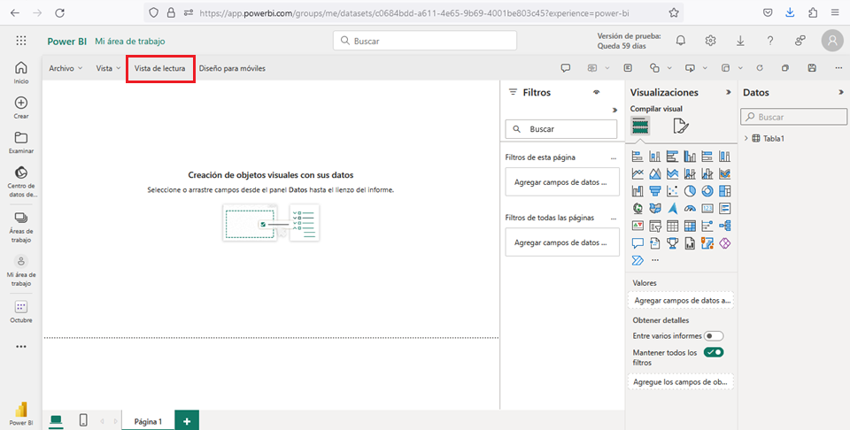

## Suscribirse al servicio Power BI

Para crear contenido en Power BI, se necesita una licencia de *Power BI Pro* o *Premium* por usuario (PPU). Si no tiene una cuenta de Power BI y prevé crear contenido, [regístrese](https://app.powerbi.com/signupredirect?pbi_source=web) para obtener una versión de prueba de 60 días de la licencia de Power BI Premium por usuario antes de empezar.

Complete el asistente para obtener una *licencia gratuita*. Abra el [servicio Power BI](app.powerbi.com) y seleccione el icono `Yo`.

Elija *Premium* por usuario: Iniciar prueba o Comprar Fabric ahora.

## Paso 1: Adición de datos para crear un informe

A menudo, cuando quiere crear un informe de Power BI, empieza en `Power BI Desktop`. *Power BI Desktop* ofrece más posibilidades. Puede transformar y modelar los datos, así como darles forma, antes de empezar a diseñar los informes.

Para este tutorial, comenzamos desde cero mediante la creación de un informe en el servicio Power BI en lugar del dispositivo de escritorio. Creamos un conjunto de datos a partir de un archivo simple de Microsoft Excel que contiene datos financieros de ejemplo.

* Abra el [servicio Power BI](app.powerbi.com) en el explorador.

```text
¿No tiene una cuenta?
Regístrese para obtener una versión de prueba de 60 días de Power BI Premium por usuario.
```

* Descargue el archivo de Excel que tiene los datos del Ejemplo financiero.
* Seleccione `Mi área de trabajo` en el panel de navegación.
* Seleccione `Nuevo` > `conjunto de datos` para iniciar el proceso de importación. Se abre la página Agregar datos para empezar a compilar un informe.

```text
Nota

Si selecciona (Cargar) en lugar de (Nuevo), el servicio Power BI carga todo el libro de Excel.
Después, puede abrir y editar el libro en Excel Online.
```

* En la página `Agregar datos para empezar a crear un informe`, seleccione `Excel`.
* En el cuadro de diálogo *Seleccionar un archivo*, vaya a la ubicación donde guardó el archivo de Excel en el equipo.
* Seleccione el archivo y elija `Importar`.

El *servicio Power BI* importa los datos de ejemplo del archivo de Excel como un conjunto de datos y abre la página "Ejemplo financiero".

```text
Nota

Antes de importar un archivo .xlsx al servicio Power BI, debemos de asegurarnos que la información
que tiene este archivo o en su defecto, la información que necesitamos para los informes se encuentre
en formato de tabla (si no está en este formato, el servicio de Power BI no detectará la información).

Para convertir la información en formato de tabla, abrimos el archivo de excel y seleccionamos toda la
información (Ctrl+E) y luego (Ctrl+T), para dar formato de tabla.
```

Ahora puede usar el conjunto de datos de ejemplo para crear informes y paneles.

* En la página `Conjunto de datos` del ejemplo financiero, en la parte superior, seleccione `+ Crear un informe` > `Empezar desde cero` para abrir el editor de informes.

El servicio Power BI abre el nuevo informe en `Mi área de trabajo`. El lienzo del informe está en blanco y muestra los paneles `Filtros`, `Visualizaciones` y `Datos`.

## Cambiar entre las vistas del informe

El nuevo informe se abre en la vista de `Edición`. Para ver el informe en curso, puede cambiar a la `Vista de Lectura` en la parte superior de la página.

<center>
    
</center>

En la vista de edición puede *crear* y *modificar* los informes, ya que es el propietario y el creador del informe.

```text
Cuando comparte el informe con compañeros de trabajo, a menudo ellos solo pueden interactuar con
el informe en la vista de lectura.
```

Otros usuarios son consumidores de informes en su sección `Mi área de trabajo`, cuando esté listo para seguir trabajando en el informe, seleccione `Editar`.

## Paso 2: Crear un gráfico en un informe

Después de conectar los datos para compilar un informe, está listo para empezar a explorar. Cuando encuentre un elemento interesante, puede guardarlo en el lienzo del informe. Puede anclar el elemento a un panel para supervisar los datos de los cambios a lo largo del tiempo.

Podemos empezar por agregar un gráfico de *columnas* al informe en el editor para crear una visualización de los datos.

* En el panel `Datos`, seleccione la flecha situada junto al encabezado finanzas para mostrar los elementos de datos.

```text  
Algunos elementos de datos tienen un símbolo sigma (Σ) junto al nombre. Power BI muestra el sigma
junto a los datos que tienen valores numéricos.
```

* En finanzas, seleccione el elemento de datos Ventas brutas y, a continuación, seleccione el elemento Fecha.
  Power BI analiza los datos seleccionados y crea una visualización del gráfico de columnas.

Nota
Si selecciona el elemento Fecha antes de seleccionar el elemento Ventas brutas, Power BI crea una tabla en lugar de un gráfico de columnas. Si seleccionó los elementos de datos en este orden, no es un problema. Cambiaremos la visualización de los datosen el paso siguiente.

3. Vamos a probar otra presentación de los datos seleccionados. Los gráficos de líneas son buenos objetos visuales para mostrar cambios en los valores a lo largo del tiempo. En el panel Visualizaciones, seleccione la opción Gráfico de líneas.
4. El gráfico de líneas parece interesante, por lo que vamos a anclar la visualización a un panel. Seleccione el icono Anclar en la visualización.

Cuando se trata de un informe nuevo, se le pide que lo guarde antes de poder anclar la visualización a un panel.

* Escriba un nombre para el informe, como Informe de ejemplo financiero y seleccione Guardar.

Power BI guarda el informe en la ubicación seleccionada. El valor predeterminado es Mi área de trabajo. Power BI muestra el informe en la vista de lectura.

5. Coloque el mouse sobre la visualización y vuelva a seleccionar el icono Anclar. Se abre el cuadro de diálogo Anclar al panel.
6. En el cuadro de diálogo emergente, seleccione Nuevo panel y escriba un nombre para el panel, como Panel de ejemplo financiero. Seleccione Anclar.
  Power BI muestra un mensaje de operación correcta después de que el servicio agregue la visualización al panel. El cuadro de diálogo correcto incluye una opción para crear un diseño optimizado del panel para el dispositivo móvil.
7. En el cuadro de diálogo del mensaje, seleccione Ir al panel.
  Después de anclar una visualización, se ancla en el panel como un icono. Los datos en la visualización permanecen actualizados para que pueda realizar un seguimiento del valor más reciente de un vistazo.

Nota
Después de anclar una visualización, si cambia el tipo de visualización del informe después de anclarla, la visualización anclada en el panel no cambiará. Para ver la nueva visualización, ánclela al panel para crear otro icono. El uso de varios iconos le permite tener más de una visualización de los mismos datos en el panel.

8. Ahora seleccione el icono en el panel:
  El servicio Power BI le devuelve al editor de informes, donde puede refinar la visualización
  Puede seleccionar Editar para volver a la vista de edición y continuar explorando y anclando iconos.

## Paso 3: Explorar visualizaciones con Preguntas y respuestas

Para realizar una exploración rápida de los datos, pruebe a formular una pregunta en el cuadro Preguntas y respuestas. Preguntas y respuestas le permite formular consultas en lenguaje natural sobre los datos.

En el servicio Power BI, puede encontrar el cuadro de Preguntas y respuestas en dos lugares.

* En un panel, el cuadro de Preguntas y respuestas Formular una pregunta sobre los datos se encuentra en la parte superior de la vista de mosaico:
* En el editor de informes, el cuadro de Preguntas y respuestas Formular una pregunta se encuentra en la barra de menús superior:

Al seleccionar el cuadro de Preguntas y respuestas, Power BI abre una vista extendida para ayudarle a formular preguntas y encontrar respuestas.

Vamos a probar la experiencia de Preguntas y respuestas para un panel.

1. En el servicio Power BI, seleccione Mi área de trabajo y, a continuación, seleccione el panel de Ejemplo financiero.
2. En la parte superior de la vista de mosaico, seleccione Hacer una pregunta sobre los datos. La vista se expande y Preguntas y respuestas ofrece varias sugerencias.
  Puede seleccionar una sugerencia y ver los resultados o escribir su propia pregunta en el cuadro de Preguntas y respuestas.
3. En el cuadro de Preguntas y respuestas, escriba la pregunta cuál es la venta promedio. A medida que escribe, Preguntas y respuestas intenta hacer coincidir la entrada de texto con las preguntas reconocidas.
  Preguntas y respuestas busca una respuesta y la presenta como una visualización de una tarjeta.
4. En la parte superior derecha, seleccione Anclar visualización y ancle esta visualización al panel de Ejemplo financiero.
5. Pruebe otra pregunta en el cuadro de Preguntas y respuestas. Escriba beneficio total por país.
6. Ancle la visualización del mapa de país o región al panel de Ejemplo financiero.
7. En el cuadro de diálogo correcto, seleccione Ir al panel para ver los iconos recién anclados en el panel.
8. En el panel, seleccione el mapa de país o región anclado. Observe cómo se abre la visualización en Preguntas y respuestas.
9. En el cuadro Preguntas y respuestas, coloque el cursor después de por país y escriba como barra. Power BI crea un gráfico de barras con los resultados.
10. Ancle el gráfico de barras al panel de Ejemplo financiero.
11. En la parte superior, seleccione Salir de Preguntas y respuestas para volver al panel.

Ahora tiene cuatro iconos anclados en el panel: gráfico de líneas, promedio numérico, mapa de país o región y gráfico de barras.

### Anclar vistas diferentes de datos con varios iconos

Tenga en cuenta que, aunque cambió la visualización de mapa a un gráfico de barras en Preguntas y respuestas, el icono correspondiente en el panel sigue apareciendo un mapa.

Al anclar un icono a un panel, el icono siempre muestra los datos mediante el tipo de visualización original. Si cambia el tipo de visualización de un icono existente y ancla el icono, Power BI crea un nuevo icono con el nuevo tipo de visualización. El icono original permanece sin cambios. El uso de varios iconos le permite tener más de una visualización de los mismos datos en el panel.

## Paso 4: Ajustar el diseño del icono en el panel

Los iconos del panel se pueden reorganizar y ajustar para hacer un mejor uso del espacio. Puede cambiar los tamaños de los iconos, su posición y trabajar con los detalles para mejorar el diseño.

### Ajustar el tamaño del icono

Vamos a cambiar el tamaño del icono del gráfico de líneas de Ventas brutas para que sea del mismo alto que el icono Promedio de ventas.

1. Seleccione la esquina inferior derecha del icono gráfico de líneas de Ventas brutas y arrastre el contorno del icono hacia arriba para reducir el alto general del icono.
2. Continúe arrastrando el contorno del icono hacia arriba hasta que el icono se ajuste a su lugar en el mismo alto que el icono Promedio de ventas.
3. Cuando el icono tenga el alto deseado, suelte el mouse.

Ahora los dos iconos tienen la misma altura.

### Modificación de los detalles del icono

A veces, cambiar los detalles del icono puede mejorar la presentación del panel.

1. En el icono Promedio de ventas, seleccione Más opciones (...)>Editar detalles.
2. En el cuadro de diálogo Detalles del icono, en el cuadro Título, escriba Promedio de ventas.
3. Seleccione Aplicar.

### Reorganizar iconos

Puede mover un icono al seleccionarlo y arrastrarlo a una nueva ubicación.

1. Seleccione el icono de mapa de país o región y arrastre el icono a la derecha del gráfico de barras.
2. Cuando el icono esté en la posición deseada, suelte el mouse.

Observe que estos dos iconos ocupan más ancho en el panel que el icono de gráfico de líneas de Ventas brutas y el icono Promedio de ventas. Puede mejorar el diseño aumentando el ancho general del icono del gráfico de líneas.

Este es un ejemplo del panel con el diseño mejorado:

### Limpieza de recursos

Después de finalizar el tutorial, se recomienda eliminar el conjunto de datos, el informe y el panel.

Al eliminar un conjunto de datos, el servicio Power BI también elimina todos los informes e iconos del panel que usan datos del conjunto de datos.

1. En el servicio Power BI, seleccione Mi área de trabajo.
2. Busque el conjunto de datos del Ejemplo financiero.
3. Seleccione Más opciones>Eliminar.
  Power BI muestra un mensaje de advertencia que indica que También se eliminarán todos los iconos del panel y los informes que contengan datos de este conjunto de datos.
4. Seleccione Eliminar.
